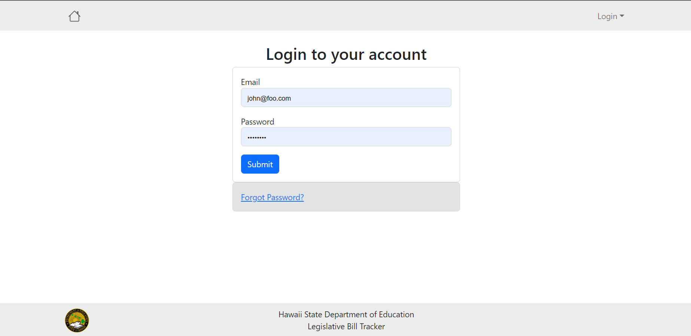
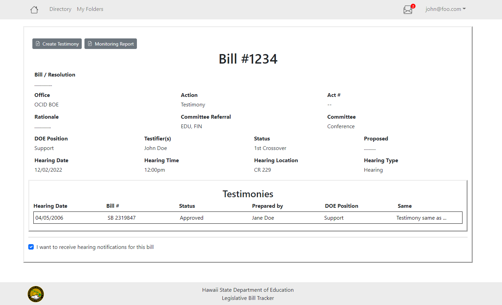
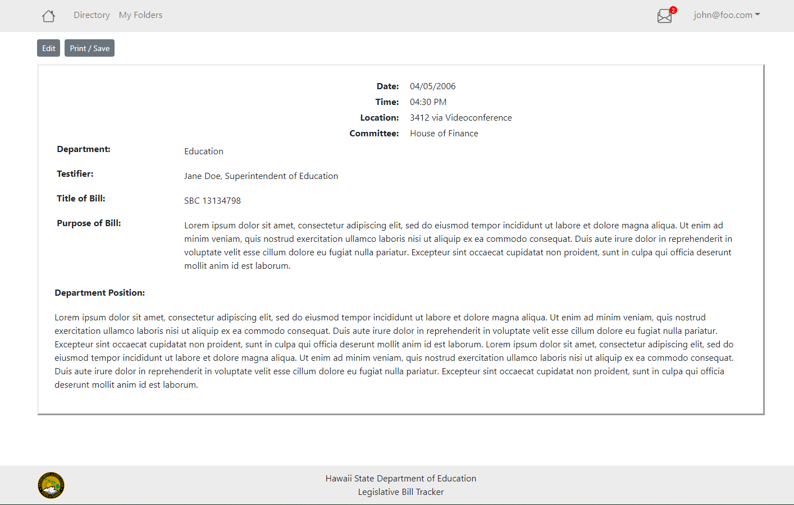
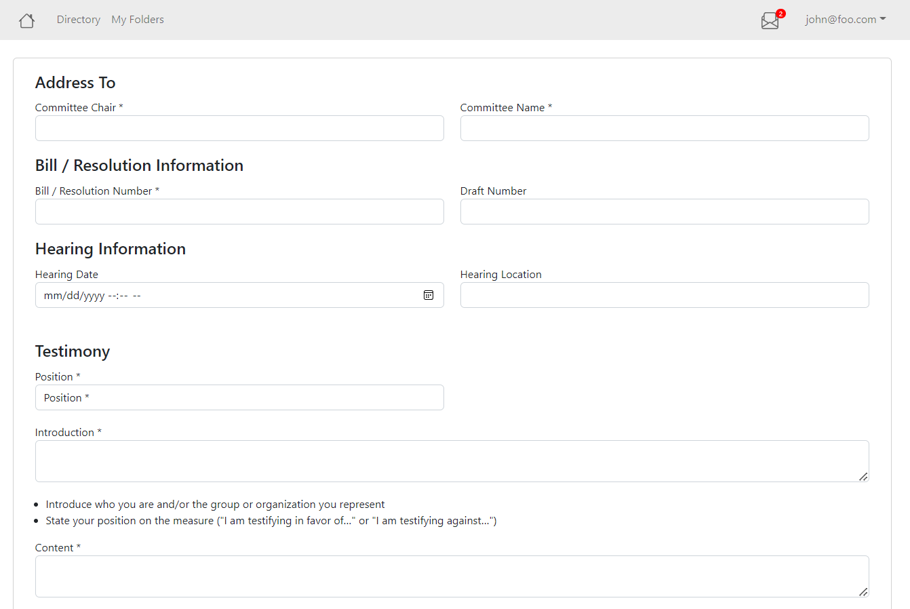
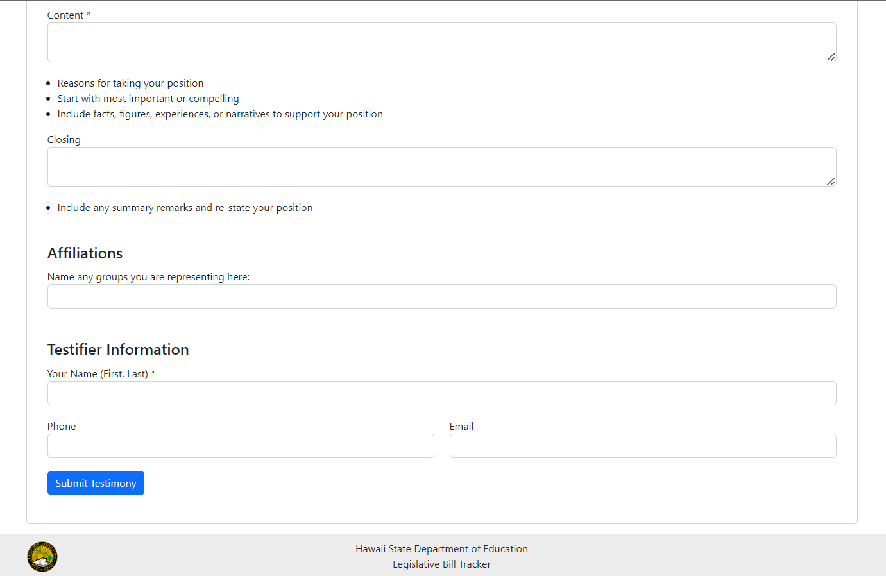
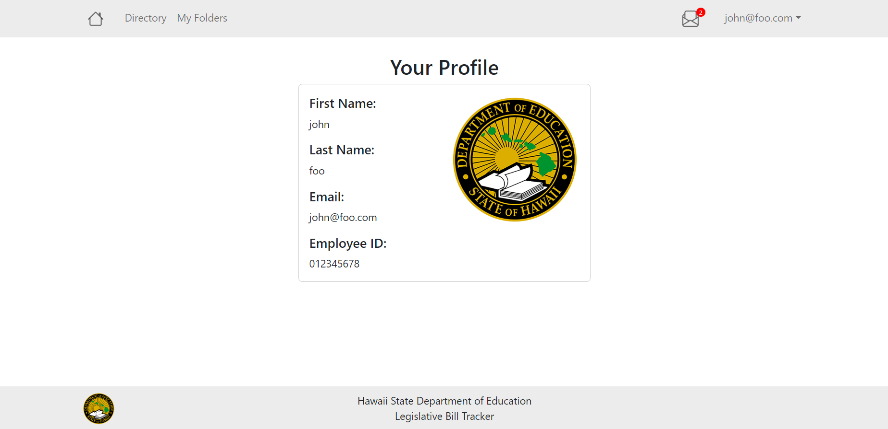
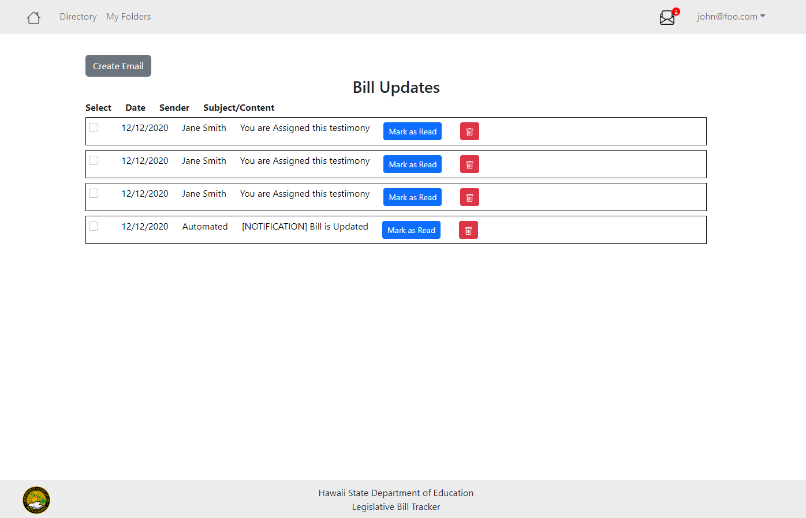
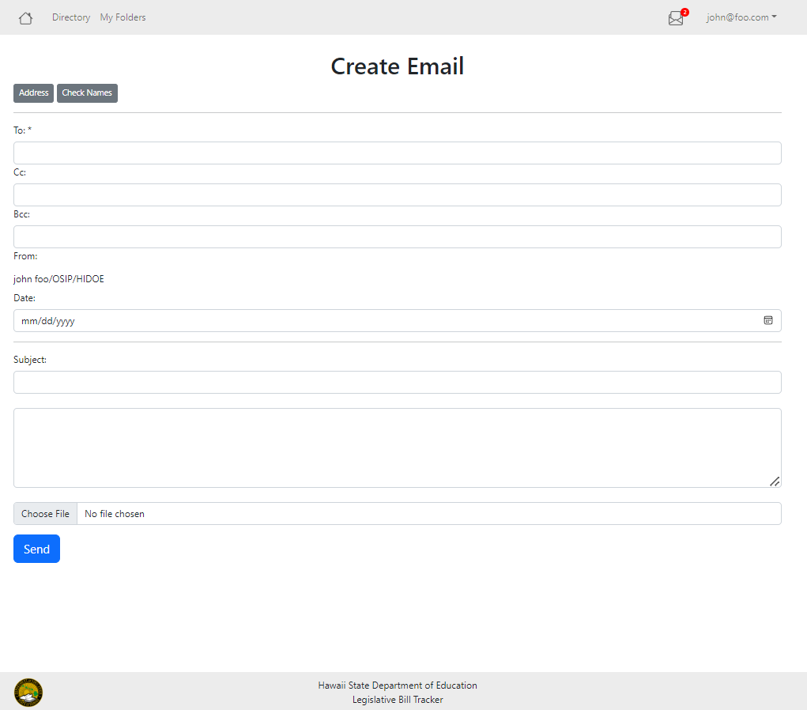
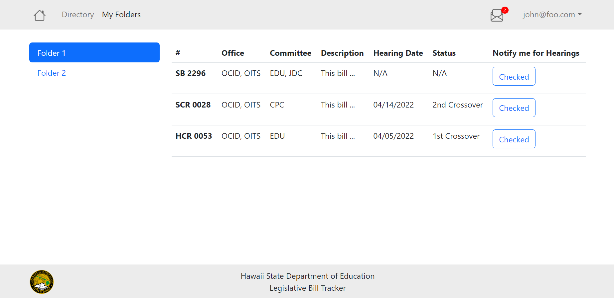

# Hawaii DoE Legislative Tracker

## Table of Contents
- [Overview](#overview)
- [Developer Guide](#developer-guide)
- [Contract](#contract)
- [Meet the Developers](#meet-the-developers)
- [User Stories](#user-stories)

## Overview

### The Problem
The Hawaii Department of Education has an outdated legislative tracking system (LTS) that has slow and inconvenient workflows, as well as a deprecated server. Their current system manager retires within the next five years and there would be no other member to provide support for the LTS.  They want to upgrade, modernize, and replace their current LTS before their current system manager retires.

### The Solution
Our solution is to make a tracker that encompasses the required “Key Components” outlined in the sections of the home page. For example, we will add these features to: Add, Remove, and Store bills, the ability to sort the viewed bills by preference of user, and have notifications sent out via email that the user has signed up with. A potential feature to be suggested is a new in-client mailbox/notification system. The New LTS will increase the clarity and legibility of the previous system by eliminating unnecessary clutter and allow for easier navigation of the web page to the user. Overall our solution and or goal is to **enable HIDOE to track legislation and set up workflow processes more efficiently and accurately than before.** 


## Mockup Pages 

### Login Page 



### Homescreen/Directory Page 


### View Bill Page



### View Testimony Page



### Create Testimony Page




### Profile Page 



### Inbox Page 



### Create Email Page



### Folders Page




## Developer Guide

### Installation
- First, [install meteor](https://www.meteor.com/developers/install).
- Second, download the [hidoe-legistracker repository](https://github.com/hidoe-legistracker/hidoe-legistracker) into your local system.
- Third, open a terminal and navigate into the hidoe-legistracker/app directory.
- Fourth, install the required meteor libraries by typing the following into the terminal:

```
$ meteor npm install
```

### Running the Application
- Upon completion of the installation process, ensure you are still in the hidoe-legistracker/app directory and enter the following into the terminal:

```
$ meteor npm run start
```

- If this is your first time starting the application, it will create the default data. This should be the output:

```
=> Started proxy.                             
=> Started HMR server.                        
=> Started MongoDB.                           
I20220529-12:09:18.384(-10)? Creating the default user(s)
I20220529-12:09:18.389(-10)?   Creating user admin@foo.com.
I20220529-12:09:18.453(-10)?   Creating user john@foo.com.
I20220529-12:09:18.515(-10)? Creating default data.
I20220529-12:09:18.515(-10)?   Adding: Basket (john@foo.com)
I20220529-12:09:18.599(-10)?   Adding: Bicycle (john@foo.com)
I20220529-12:09:18.600(-10)?   Adding: Banana (admin@foo.com)
I20220529-12:09:18.601(-10)?   Adding: Boogie Board (admin@foo.com)
I20220529-12:09:18.773(-10)? Monti APM: completed instrumenting the app
=> Started your app.

=> App running at: http://localhost:3000/
```

Ignore “bcrypt warning”: Bcrypt is used for password checking and it is safe to ignore the warning during development stages.

- You can now open up your app on a webpage at: [http://localhost:3000/](http://localhost:3000/)
- To reset the app, exit meteor by pressing Control-C into the terminal, and type:

```
$ meteor reset
```

## User Stories

User stories can be found [here](https://github.com/orgs/hidoe-legistracker/discussions/24)

## Contract

The team contract can be found [here](https://docs.google.com/document/d/1d5hWC9UI-d54y6Xm_KRcY7tM6J-MPeAJtlEd1LMBdyI/edit?usp=sharing)

## Meet the Developers

- [Ethan Chee](https://ethancheez.github.io/)
- [Larissa Tsai](https://larissa-tsai.github.io/)
- [Sola Takahashi](https://soratsky.github.io/)
- [Edalaine Cadiena](https://ecadiena.github.io/)
- [Ian Manzano](https://ianbm.github.io/)
- [Cris Javier](https://crisjavier.github.io/)
- [Cole Amparo](https://coleamparo.github.io/)
- [Adam Parrilla](https://adamjparrilla.github.io/)
- [Michael Pierce](https://michaelrpierce.github.io/)
